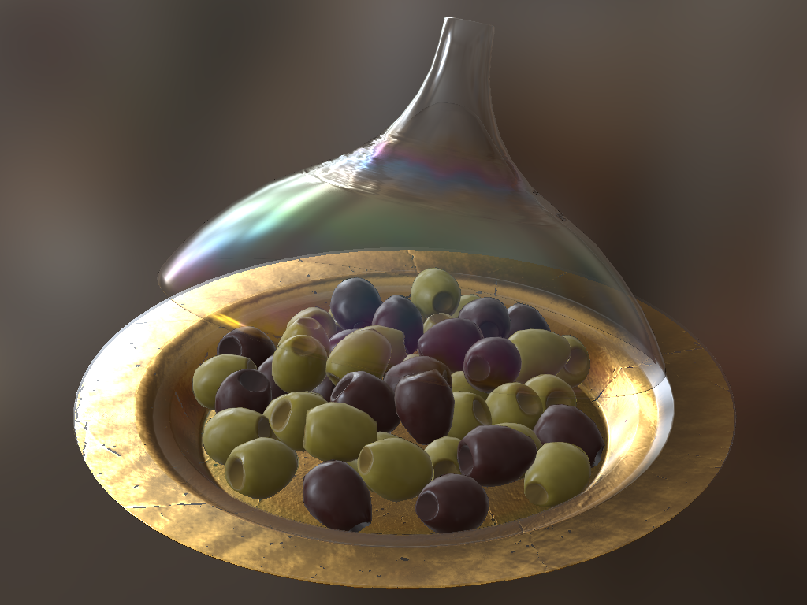
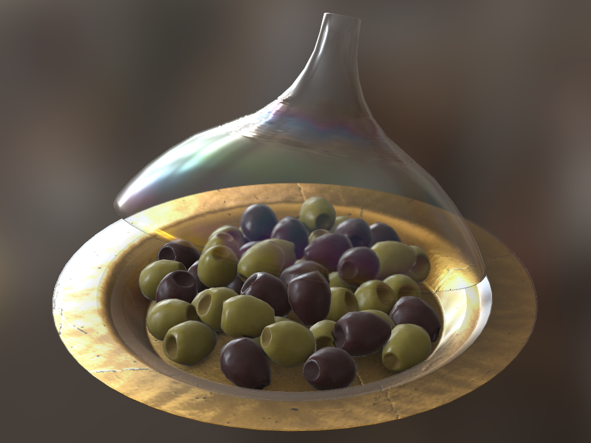

## guc

guc is a glTF to [Universal Scene Description](https://github.com/PixarAnimationStudios/USD) (USD) converter.

Unlike...
 - [gltf2usd](https://github.com/kcoley/gltf2usd), it aims to be more than a PoC
 - [usd_from_gltf](https://github.com/google/usd_from_gltf), it is not AR Quick Look centric
 - [Apple's USDZ Tools](https://developer.apple.com/augmented-reality/tools/), it is open-source and freely available

guc furthermore supports near-lossless material translation via the [MaterialX](https://github.com/AcademySoftwareFoundation/MaterialX) standard.
Shading networks can be encoded as UsdShade and flattened for backwards compatibility.

All glTF features except animation and skinning are implemented and have been tested on Khronos's [sample](https://github.com/KhronosGroup/glTF-Sample-Models) and [validation](https://github.com/KhronosGroup/glTF-Asset-Generator) models.

<p align="middle">
  
  
</p>
<p align="middle">
  Wayfair's <a href="https://github.com/KhronosGroup/glTF-Sample-Models/tree/16e803435fca5b07dde3dbdc5bd0e9b8374b2750/2.0/IridescentDishWithOlives">Iridescent Dish with Olives</a> (<a href="https://creativecommons.org/licenses/by/4.0/">CC BY</a>) converted to USD+MaterialX with guc and rendered in hdStorm (left).
  The same model in Khronos's <a href="https://github.khronos.org/glTF-Sample-Viewer-Release/">glTF Sample Viewer</a> (right).
</p>

### Build

You need <a href="https://github.com/PixarAnimationStudios/USD/tree/v22.11">USD 22.08+</a> with MaterialX and OpenImageIO support enabled.

Do a recursive clone of the repository and set up a build folder:
```
git clone https://github.com/pablode/guc --recursive
mkdir guc/build && cd guc/build
```

Pass following parameters in the CMake generation phase:
```
cmake .. -Wno-dev \
         -Dpxr_DIR=<USD_INSTALL_DIR> \
         -DCMAKE_BUILD_TYPE=Release
```

Build the executable:
```
cmake --build . -j8 --target guc --config Release
```

> Note: If you're using MSVC, be sure to select a 64-bit generator.

### Usage

```
Usage: guc <gltf_path> <usd_path> [params]

Available params:
--emit-mtlx                       Emit MaterialX materials in addition to UsdPreviewSurfaces
--mtlx-as-usdshade                Convert and inline MaterialX materials with UsdMtlx
--flatten-nodes                   Flatten MaterialX glTF PBR nodes to stdlib and pbrlib nodes
--explicit-colorspace-transforms  Explicitly transform colorspaces using MaterialX nodes
--hdstorm-compat                  Apply compatibility tweaks for the USD hdStorm renderer
```

Both `.gltf` and `.glb` file types are valid input. `.usda` and `.usdc` USD formats can be written.

Debug logging can be enabled by defining the `TF_DEBUG="GUC"` environment variable.

### Extension support

Name                                | Status&nbsp;&nbsp;&nbsp;&nbsp;&nbsp;&nbsp;&nbsp;&nbsp;&nbsp;&nbsp;&nbsp;&nbsp;&nbsp;&nbsp;&nbsp;&nbsp;&nbsp;&nbsp;&nbsp;&nbsp;&nbsp;&nbsp;&nbsp;&nbsp;
------------------------------------|----------
KHR_draco_mesh_compression          | ❌ Not supported
KHR_lights_punctual                 | ✅ Partial <sup>1</sup>
KHR_materials_clearcoat             | ✅ Complete
KHR_materials_ior                   | ✅ Complete
KHR_materials_sheen                 | ✅ Complete
KHR_materials_specular              | ✅ Complete
KHR_materials_transmission          | ✅ Complete
KHR_materials_unlit                 | 🚧 Planned
KHR_materials_variants              | 🚧 Planned
KHR_materials_volume                | ✅ Partial <sup>2</sup>
KHR_mesh_quantization               | ❌ Not supported
KHR_texture_basisu                  | ❌ Not supported
KHR_texture_transform               | 🚧 Planned
KHR_xmp_json_ld                     | ❌ Not supported

<sup>\[1\]</sup> Spotlight cone falloff is ignored.  
<sup>\[2\]</sup> Thickness is <a href="https://github.com/AcademySoftwareFoundation/MaterialX/pull/861">not supported</a> by the MaterialX glTF PBR implementation.

### Known limitations

Normal map bitangents are currently [not supported](https://github.com/AcademySoftwareFoundation/MaterialX/issues/945) in MaterialX.

### Apple AR Quick Look compatibility

I have no intention of implementing workarounds for Apple's incomplete USD support. [usd_from_gltf](https://github.com/google/usd_from_gltf) or [Apple's USDZ Tools](https://developer.apple.com/augmented-reality/tools/) should be used instead.

### License

```

   Copyright 2022 Pablo Delgado Krämer

   Licensed under the Apache License, Version 2.0 (the "License");
   you may not use this file except in compliance with the License.
   You may obtain a copy of the License at

       http://www.apache.org/licenses/LICENSE-2.0

   Unless required by applicable law or agreed to in writing, software
   distributed under the License is distributed on an "AS IS" BASIS,
   WITHOUT WARRANTIES OR CONDITIONS OF ANY KIND, either express or implied.
   See the License for the specific language governing permissions and
   limitations under the License.

```
