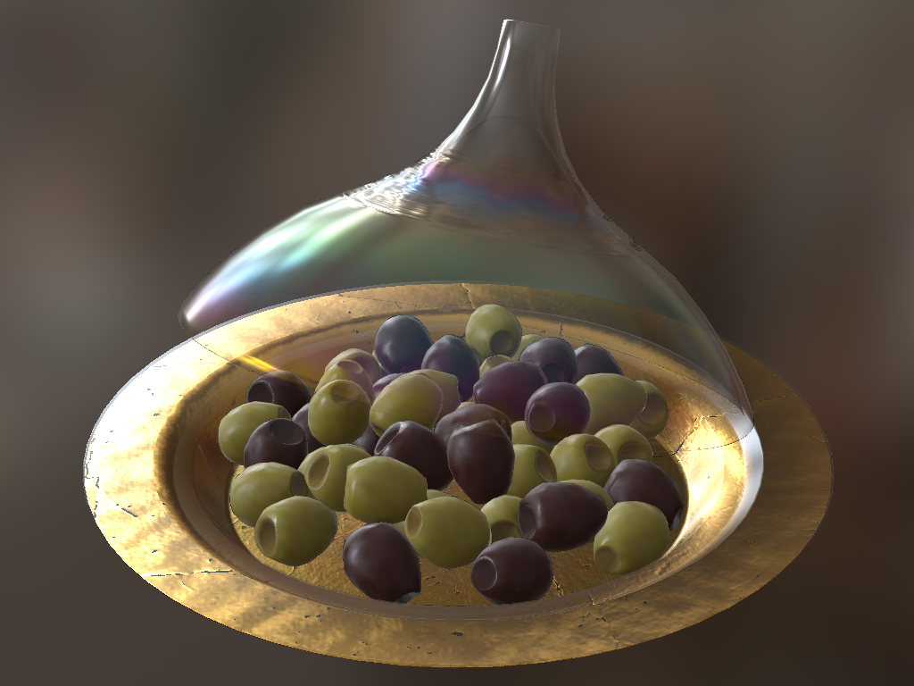
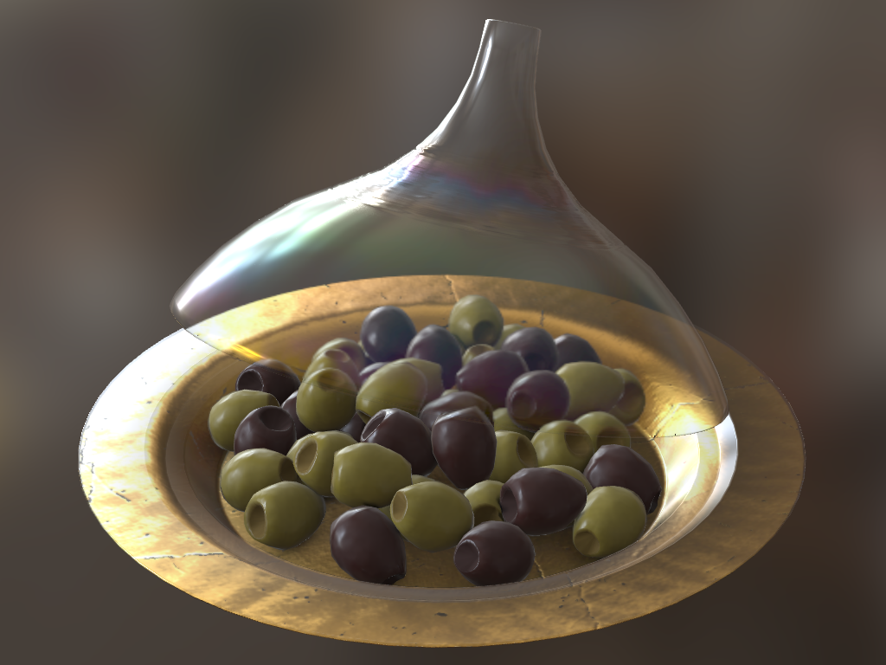

## guc


guc is a glTF to [Universal Scene Description](https://github.com/PixarAnimationStudios/USD) (USD) converter.

It aims to represent glTF assets a closely as possible within USD. To that end, it uses [MaterialX](https://github.com/AcademySoftwareFoundation/MaterialX) as a standard for material and look interchange.

All glTF features with the exception of animation and skinning are implemented and get continuously tested in guc's [test suite](https://github.com/pablode/guc-tests).

<p align="middle">
  
  
</p>
<p align="middle">
  Wayfair's <a href="https://github.com/KhronosGroup/glTF-Sample-Models/tree/16e803435fca5b07dde3dbdc5bd0e9b8374b2750/2.0/IridescentDishWithOlives">Iridescent Dish with Olives</a> (<a href="https://creativecommons.org/licenses/by/4.0/">CC BY</a>) converted to USD+MaterialX with guc and rendered in Storm (left).
  The same model in Khronos's <a href="https://github.khronos.org/glTF-Sample-Viewer-Release/">glTF Sample Viewer</a> (right).
</p>

### Build

You need USD v24.11+ (e.g. <a href="https://github.com/PixarAnimationStudios/OpenUSD/releases/tag/v26.05">v26.05</a>) with MaterialX support enabled.

Do a recursive clone of the repository and set up a build folder:
```
git clone https://github.com/pablode/guc --recursive
mkdir guc/build && cd guc/build
```

Pass following parameters in the CMake generation phase:
```
cmake .. -Wno-dev -DCMAKE_BUILD_TYPE=Release
```

Build the executable:
```
cmake --build . -j8 --config Release
```

> Note: set `BUILD_SHARED_LIBS` for shared builds, and `CMAKE_MSVC_RUNTIME_LIBRARY` to USD's MSVC ABI.

### Usage

```
guc 0.6 - glTF to USD converter

Usage: guc [options] [--] <gltf_path> <usd_path>

Options:
  -m, --emit-mtlx                            Emit MaterialX materials in addition to UsdPreviewSurfaces
  -u, --mtlx-as-usdshade                     Convert and inline MaterialX materials into the USD layer using UsdMtlx
  -v, --default-material-variant=<index>     Index of the material variant that is selected by default
  -s, --skip-validation                      Skip glTF validation for reduced processing time
  -l, --licenses                             Print the license of guc and third-party libraries
  -h, --help                                 Show the command help
```

Both glTF and GLB file types are valid input. USDA, USDC and USDZ formats can be written.

### Documentation

* [Example asset conversion](docs/Conversion_Process.md)
* [Technology limitations and open problems](docs/Technology_Limitations.md)
* [Sdf plugin](docs/Sdf_Plugin.md)

### Extension support

Name                                | Status&nbsp;&nbsp;&nbsp;&nbsp;&nbsp;&nbsp;&nbsp;&nbsp;&nbsp;&nbsp;&nbsp;&nbsp;&nbsp;&nbsp;&nbsp;&nbsp;&nbsp;&nbsp;&nbsp;&nbsp;&nbsp;&nbsp;&nbsp;&nbsp;
------------------------------------|----------
EXT_meshopt_compression             | ✅ Complete
KHR_draco_mesh_compression          | ✅ Complete
KHR_gaussian_splatting              | 🚧 In Progress
KHR_lights_punctual                 | ✅ Partial <sup>1</sup>
KHR_materials_clearcoat             | ✅ Complete
KHR_materials_emissive_strength     | ✅ Complete
KHR_materials_ior                   | ✅ Complete
KHR_materials_iridescence           | ✅ Complete
KHR_materials_sheen                 | ✅ Complete
KHR_materials_specular              | ✅ Complete
KHR_materials_transmission          | ✅ Complete
KHR_materials_unlit                 | ✅ Complete
KHR_materials_variants              | ✅ Complete
KHR_materials_volume                | ✅ Partial <sup>2</sup>
KHR_mesh_quantization               | ✅ Complete
KHR_node_visibility                 | ✅ Complete
KHR_texture_transform               | ✅ Complete

<sup>\[1\]</sup> Spotlight cone falloff is ignored.  
<sup>\[2\]</sup> Thickness is not supported by the MaterialX glTF PBR implementation.

### License

```

   Copyright 2024 Pablo Delgado Krämer

   Licensed under the Apache License, Version 2.0 (the "License");
   you may not use this file except in compliance with the License.
   You may obtain a copy of the License at

       http://www.apache.org/licenses/LICENSE-2.0

   Unless required by applicable law or agreed to in writing, software
   distributed under the License is distributed on an "AS IS" BASIS,
   WITHOUT WARRANTIES OR CONDITIONS OF ANY KIND, either express or implied.
   See the License for the specific language governing permissions and
   limitations under the License.

```
