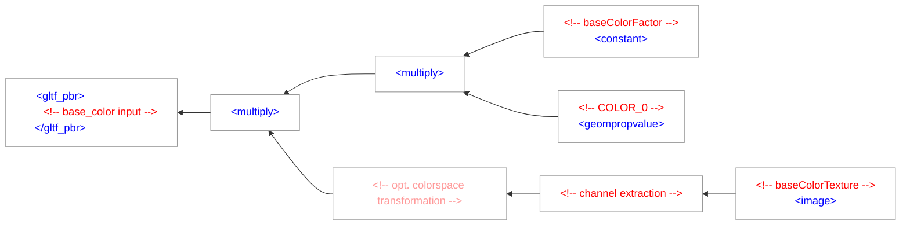

# Structure Mapping

guc's conversion process produces self-containing components, which can then be
composed as part of a larger assembly.
A consumer may modify the components as needed, however artist-friendliness
(layering, shading network complexity) can not be ensured due to the lack of usage annotations
and the need to support the space of legal glTF constructions.
The converted assets are hence intended to be used "as-is", for instance as leaf
nodes in a USD-based pipeline, and not as intermediate products in a content-authoring pipeline.


## Case Study: A golden triangle

In the following example, we're going to see how guc translates the golden triangle from
[Chapter 11](https://github.khronos.org/glTF-Tutorials/gltfTutorial/gltfTutorial_011_SimpleMaterial.html) of Khronos's glTF tutorial.

<table align=center>
<tr>
<td>

</td>
<td>

```json
{
  "asset" : { "version" : "2.0" },
  "scene": 0,
  "scenes" : [ { "nodes" : [ 0 ] } ],
  "nodes" : [ { "mesh" : 0 } ],
  "meshes" : [
    {
      "primitives" : [ {
        "attributes" : {
          "POSITION" : 1
        },
        "indices" : 0,
        "material" : 0
      } ]
    }
  ],
  "materials" : [
    {
      "pbrMetallicRoughness": {
        "baseColorFactor": [ 1.000, 0.766, 0.336, 1.0 ],
        "metallicFactor": 0.5,
        "roughnessFactor": 0.1
      }
    }
  ],
  "..."
}
```

</td>
</tr>
</table>

<p align="center">
 A render of the golden glTF triangle (left), and its corresponding JSON (right).
</p>

### Asset and Scenes

Upon conversion, guc creates a root prim, `/Asset`, under which scenes and materials reside.
Scenes contain Xform, mesh, camera and light prims.

For the "golden triangle" example above, following high-level scene structure is generated:
```
#usda 1.0
(
    defaultPrim = "Asset"
    doc = "Converted from glTF with guc 0.2"
    metersPerUnit = 1
    upAxis = "Y"
)

def Xform "Asset" (
    customData = {
        string version = "2.0"
    }
    kind = "component"
)
{
    def Xform "Scenes"
    {
        def Xform "scene"
        {
            # ...
```

Only the default scene is authored as visible, and if no scenes exists, the glTF file is a _library_.
guc then generates an asset-level `/Nodes` prim.

### Nodes

Nodes are glTF graph elements with an optional transformation, which can either contain a number of nodes, or a reference to a mesh, camera, or light. Nodes are translated to Xforms under the scene prim. Meshes, cameras and lights are "instanced" across scenes through references, but instancing of node trees does not exist.

### Meshes

The glTF buffer, bufferView and accessor concepts are reduced to a single prim,
in the case of the example above, following mesh prim:

```
def Mesh "submesh" (
    prepend apiSchemas = ["MaterialBindingAPI"]
)
{
    float3[] extent = [(0, 0, 0), (1, 1, 0)]
    int[] faceVertexCounts = [3]
    int[] faceVertexIndices = [0, 1, 2]
    rel material:binding = </Asset/Materials/MaterialX/Materials/mat>
    rel material:binding:preview = </Asset/Materials/UsdPreviewSurface/Materials/mat>
    normal3f[] normals = [(0, 0, 1), (0, 0, 1), (0, 0, 1)] (
        customData = {
            dictionary guc = {
                bool generated = 1
            }
        }
        interpolation = "vertex"
    )
    point3f[] points = [(0, 0, 0), (1, 0, 0), (0, 1, 0)]
    color3f[] primvars:displayColor = [(1, 0.766, 0.336)] (
        customData = {
            dictionary guc = {
                bool generated = 1
            }
        }
        interpolation = "constant"
    )
    uniform token subdivisionScheme = "none"
}
```

Depending on material parameters and available accessors, guc creates following primvars:

Name | Description
---  | ---
color[N] | Vertex color set N
displayColor | Display color (constant or per-vertex)
displayOpacity | Display opacity (constant or per-vertex)
opacity[N] | Vertex opacity set N
st[N] | Texture coordinate set N
tangents | Three-component tangent vectors
bitangentSigns | Bitangent handedness

Additionally, a material binding relationship is always authored on the prim and its
overrides, potentially binding a default material.

### Materials

guc authors UsdPreviewSurface and MaterialX material collections on an asset-level `/Materials` prim.
The exact path is motivated by the behaviour of UsdMtlx, which implicitly creates prim scopes.

The generated UsdPreviewSurface material for the example above looks like this:
```
def Material "mat"
{
    token outputs:surface.connect = </Asset/Materials/UsdPreviewSurface/Materials/mat/node.outputs:surface>

    def Shader "node"
    {
        uniform token info:id = "UsdPreviewSurface"
        float3 inputs:diffuseColor = (1, 0.766, 0.336)
        float inputs:metallic = 0.5
        float inputs:roughness = 0.1
        token outputs:surface
    }
}
```

While the generated MaterialX document is approximately the following:
```xml
<?xml version="1.0"?>
<materialx version="1.38" colorspace="lin_rec709">
  <gltf_pbr name="SR_mat" type="surfaceshader">
    <input name="base_color" type="color3" value="1, 0.766, 0.336" />
    <input name="occlusion" type="float" value="1" />
    <input name="metallic" type="float" value="0.5" />
    <input name="roughness" type="float" value="0.1" />
  </gltf_pbr>
  <surfacematerial name="mat" type="material">
    <input name="surfaceshader" type="surfaceshader" nodename="SR_mat" />
  </surfacematerial>
</materialx>
```


## MaterialX material translation

guc makes use of MaterialX's [glTF PBR implementation](https://github.com/AcademySoftwareFoundation/MaterialX/blob/f66296b25e095aad135834aa8e59c13282adcdd7/libraries/bxdf/gltf_pbr.mtlx), with the shading logic being maintained and developed by MaterialX contributors.

guc's leftover responsibility is to instantiate the `<gltf_pbr>` node and to populate its inputs.

For example, if [Chapter 3.9.2](https://registry.khronos.org/glTF/specs/2.0/glTF-2.0.html#metallic-roughness-material)
of the glTF specification defines the base color to consist of a texture value, a factor and the vertex color,
the following node graph is generated:

Depending on conversion options, the graph may contain additional color space transformation nodes.

### Explicit tangents
Normal mapped assets require tangents generated by the MikkTSpace algorithm.
These are four-component vectors, with the last component specifiying the handedness of the bitangent.

guc constructs the tangent space from two authored primvars, _tangents_ and _bitangentSigns_, which are
read directly into a custom normal map node implementation, accounting for a limitation
of MaterialX's `<normalmap>` node (see [Ecosystem Limitations](Ecosystem_Limitations.md)).


## Future improvements

There are a number of improvements that can be made to the mapping process.

For instance, the MaterialX graph complexity can be reduced with the introduction of helper nodes.
Resulting USD assets could make use of payloads, and in general, incremental changes
motivated by the [USD Asset WG Structure Guidelines](https://github.com/pablode/usd-wg-assets/blob/main/docs/asset-structure-guidelines.md) are to be expected.

Lastly, user feedback is welcome in ensuring that assets conform to best practices.
